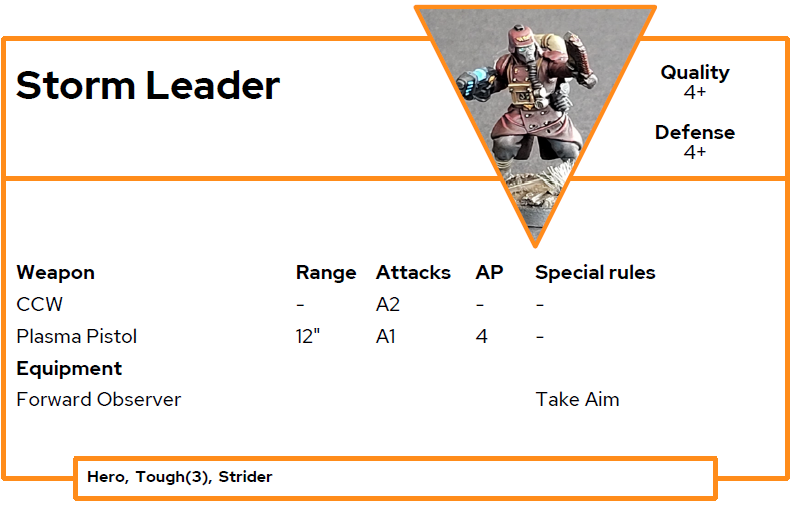
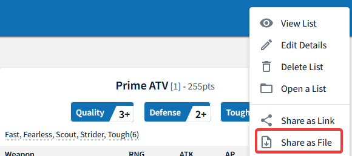
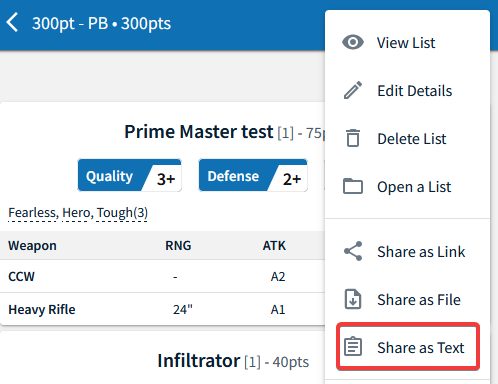

# Datacards for OPR

Tool to create PDF data cards for Onepagerules (GF, GFF, AOF, AOFS and AOFR).

## Preperation

### Use with python

- Download `OPRDatacard.py`

### Use as exe (Windows)

- Download GDFDataCards from [release](https://github.com/JackGruber/OPRDataCards/releases) page
- Store `GDFDataCards.exe` in a folder

## Usage

### With json army list

- Select in OPR army forge `Share as File` and save file
 
 
 

- Start `GDFDataCards`
- Select downloaded army list from OPR army forge

### With text army list

- Start `GDFDataCards` with parameter `--txt`
- Copy Army info from OPR army forge with `Share as Text`
 
 

- Past the text into `GDFDataCards.exe`

## Images on Datacard

To add images for the data cards, create an order `data\images` and store the image of the unit in it. The images must be named like the unit, but may only contain letters and numbers. Replace everything else with `_`.

Examples:

|Unit name|Filename|
|---|---|
|Storm Leader|Storm_Leader.png|
|2x Veteran|2x_Veteran.jpg|
