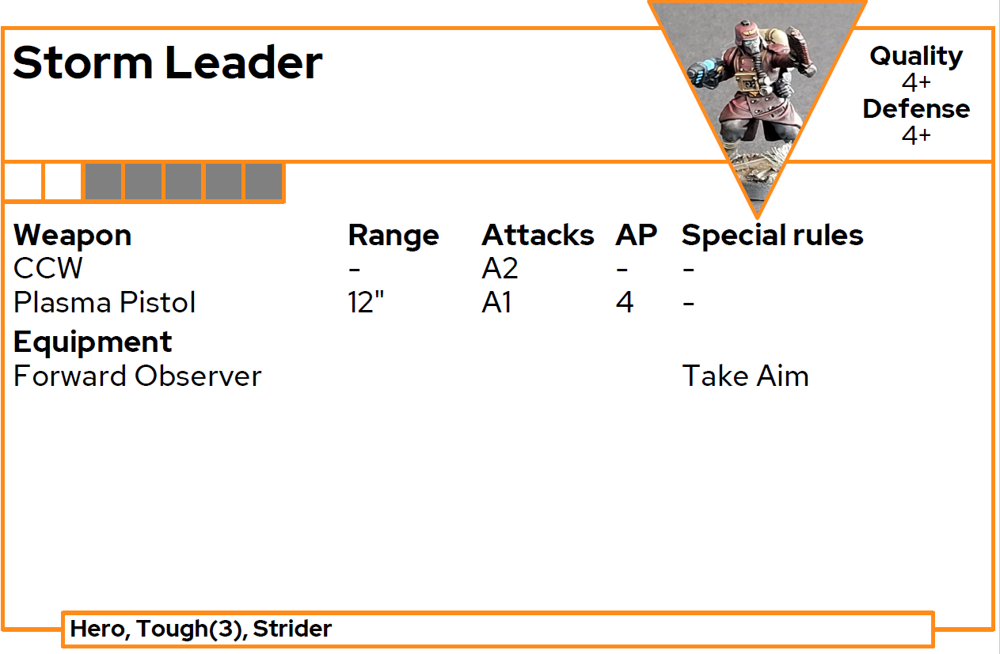

# Datacards for OPR

Tool to create PDF data cards for Onepagerules (GF, GFF, AOF, AOFS and AOFR).

## Preparation

### Use with python

- Download `OPRDatacard.py`
- Install modules from `requirements.txt`

### Use as exe (Windows)

- Download GDFDataCards from [release](https://github.com/JackGruber/OPRDataCards/releases) page
- Store `GDFDataCards.exe` in a folder

## Usage

- Download in OPR army forge a json (`Share as File`) or text `Share as Text` file
 
 
 

- Start `GDFDataCards` and select the downloaded file

## Images on Datacard

To add images to the datacards place the images with the `Unit Name` or unit `type` name in the folder `data\images`. Replace everything except letters and numbers from the Unit name / type with `_` in the file name.

Examples:

|Unit name|Filename|
|---|---|
|Storm Leader|Storm_Leader.png|
|Thaddeus_Taho|Thaddeus_Taho.jpg|
